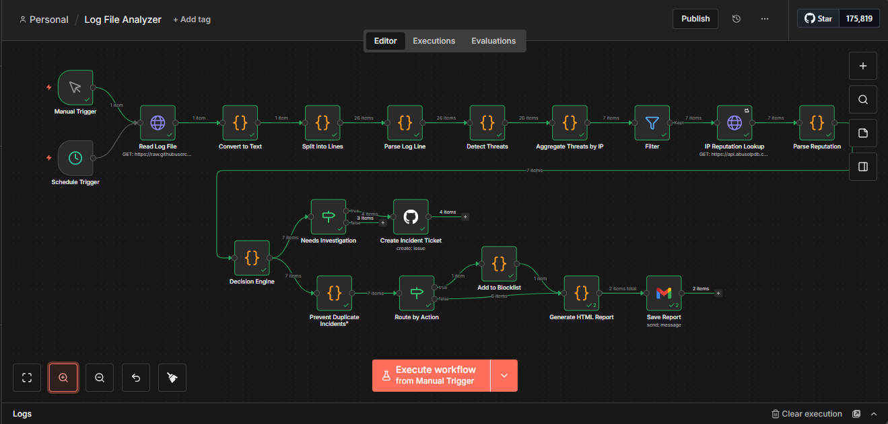

# Log File Analyzer

> Lightweight SOAR pipeline built with n8n to detect threats and attacker behavior through behavioral kill-chain scoring and IP reputation intelligence

[](LICENSE)
[](https://n8n.io)



---

## Table of Contents

- [Overview](#overview)
- [Features](#features)
- [Demo](#demo)
- [Prerequisites](#prerequisites)
- [Installation](#installation)
- [Usage](#usage)
- [Threat Detection](#threat-detection)
- [Sample Data](#sample-data)
- [Troubleshooting](#troubleshooting)
- [License](#license)

---

## Overview

**Problem:** Standard security tools often generate thousands of alerts based on "loud" events (like 1,000 requests to a bad URL), leading to alert fatigue for SOC analysts.

**Solution:** This n8n workflow replaces basic line-scoring with a behavioral kill-chain model. It tracks attacker intent over time, correlates internal behavior with external threat intelligence (AbuseIPDB), and uses persistent storage to prevent duplicate alerts.

**Technology:**
- n8n (workflow automation)
- AbuseIPDB API (External Threat Intel)
- Kill-Chain Scoring (Recon -> Discovery -> Exploit -> Compromise)
- Persistent Data Store (Deduplication cache)
- GitHub API (Incident ticket automation)
- Email/Slack alerting

## Use Cases

- **Behavioral Web Security Monitoring** - Identifying the progression of attackers from recon to exploitation on Apache and Nginx servers.
- **Brute Force & Credential Stuffing Mitigation** - High-velocity detection of automated login attempts with adaptive scoring multipliers.
- **Advanced Exploitation Tracking** - Correlation of SQL injection, XSS, and Path Traversal attempts across the Cyber Kill Chain.
- **DDoS & Botnet Pattern Recognition** - Identifying high-traffic automation tools and large-scale scanning botnets.
- **Autonomous Incident Response** - Fully automated triaging, reputation verification, and incident ticketing to reduce Mean Time to Respond (MTTR).
- **Alert Fatigue Mitigation** - Intelligent deduplication of repeating threats to ensure SOC teams only see unique, actionable incidents.

---

## Features

- **Behavioral Analysis** - Detects attack progression (Kill Chain) rather than just single events.
- **Smart Deduplication** - Prevents ticket flooding by caching incidents for 24 hours.
- **Multi-log Parsing** - Unified support for Apache, Nginx, and Linux Auth logs.
- **Executive HTML Reports** - Detailed summaries including "Automated Actions Taken" for management review.
- **Autonomous Response** - Automatically flags IPs for blocking based on reputation and intent.
- **SOC Ticket Integration** - Direct integration with [soc-incident](https://github.com/Dessybabybaby/soc-incident) for manual review.

---

## Demo

### Audio Case Study (Coming Soon)

### Visual Demo


---

## Prerequisites

**Required:**
- **n8n instance** (self-hosted or cloud)
- **AbuseIPDB API Key** (For reputation lookups)
- **GitHub Personal Access Token** (For ticket creation)

**Optional:**
- **Email/Slack** for alerts

---

## Installation

### Quick Start: Import Workflow (5 minutes)

1. **Download workflow:**
   - [Releases](https://github.com/Dessybabybaby/log-file-analyzer/releases)
   - Download `log-analyzer-workflow.json`

2. **Import to n8n:**
   - Workflows → Import from File → Select JSON

3. **Configure Credentials:**
   - Set up **GitHub API** credentials for your incident repo.
   - Set up **AbuseIPDB** as a Header Auth credential (Key: `your-api-key`).

4. **Execute workflow:**
   - Click "Execute Workflow"
   - Review generated report

5. **Schedule automated analysis:**
   - Replace Manual Trigger with Schedule Trigger (daily/weekly)

---

## Usage

### Analyzing Log Files

The workflow handles the following transitions:
1. **Parse:** Converts raw lines into IP-based objects.
2. **Score:** Assigns weight based on the attack stage (e.g., Recon vs. Exploitation).
3. **Verify:** Checks AbuseIPDB to see if the IP is a known malicious actor.
4. **Act:** Decisions are made to **BLOCK**, **INVESTIGATE**, or **MONITOR**.

### Reading Reports

**HTML Report Sections:**

1. **Executive Summary:** Quick stats on requests, unique IPs, and blocked threats.
2. **Automated Actions Taken:** A management-level table showing exact counts of Blocks vs. Investigations.
3. **Top 10 Threat IPs:** Detailed table showing IP, Risk Level, Score, and specific Behavioral Patterns (e.g., "recon, discovery").

---

## Threat Detection

### Detection Patterns & Kill Chain

Instead of scoring lines, we score **attacker behavior per IP**.

| Behavior Stage | Meaning | Score |
| :--- | :--- | :--- |
| **Recon** | Path scanning / 404 probing | +10 |
| **Discovery** | Admin panel / Privilege probing | +15 |
| **Brute Force** | Authentication failures | +20 |
| **Exploitation** | SQLi or XSS attempts | +40 |
| **Compromise** | Shell upload attempts | +60 |

### Behavioral Scoring Algorithm
```javascript
Total Score = sum(Behavior Stages) 

// Adjustments:
IF requests > 200: +25 (Automation/Bot Detection)
IF behaviors >= 3: +20 (Multi-stage Attack Bonus)

Final Threat Score = Capped at 100
```

**Decision Matrix:**
- **80-100 (CRITICAL):** Action -> BLOCK (Requires Malicious Rep + Attack Progression)
- **50-79 (HIGH):** Action -> INVESTIGATE (Opens GitHub Ticket)
- **25-49 (MEDIUM):** Action -> MONITOR (Logged in report only)

---

## Sample Data

### Test Log Files

**`sample-data/access.log`** 
**`sample-data/report_file-sample.html`**

### Running Test

### Method 1: GitHub-Hosted Log Analysis (Recommended)
1. Ensure your log file (e.g., `access.log`) is pushed to your GitHub repository.
2. Copy the **Raw** URL of the file from GitHub.
3. In n8n, open the **Read Log File** node and paste the URL into the HTTP Request field.
4. Execute the workflow. 
5. **Expected Result:** The workflow fetches the logs, identifies behavioral patterns, checks IP reputation, and creates a ticket or HTML report.

### Method 2: Local Sample Data
1. Download the provided `sample-data/access.log` from this repository.
2. In n8n, update the **Read Log File** path to your local directory (e.g., `/tmp/access.log`).
3. Execute the workflow.
4. **Expected Result:** Compare your output with `sample-data/report_file-sample.html` to ensure detection patterns match.
---

## Troubleshooting

| Issue | Solution |
|-------|----------|
| **Duplicate Tickets** | Check Prevent Duplicate Incidents node. Records are cached for 24h |
| **0 Score for IPs** | Ensure threatsDetected array is populated in the Detect Threats node |
| **AbuseIPDB Errors** | Verify your API key has remaining daily quota (Free tier is 1,000/day) |
| **Testing Repeats** | Toggle DEBUG_MODE = true in the Deduplication node to clear cache |

**Processing Large Logs:**
```bash
### 1. Split by Line Count (CLI)
To keep memory usage low while preserving enough context for the Behavioral Engine to detect the "Kill Chain," split logs into chunks of at least 20,000 lines.

# Split large log into 20k line chunks
split -l 20000 access.log access_part_

# Push parts to GitHub or your server to process sequentially

### 2. Behavioral Context & Deduplication
Because the workflow uses a 24-hour cache in the Prevent Duplicate Incidents node:

# If an IP is flagged in access_part_aa, the system will remember that decision when you process access_part_ab.
# This ensures you don't get duplicate tickets even when processing a single log file in multiple parts
```

---

## License

MIT License - see [LICENSE](LICENSE)

---

## Acknowledgments

- Inspired by [UnixGuy](https://youtube.com/@UnixGuy) - Sysadmin and log analysis tutorials
- Built with [n8n.io](https://n8n.io)

---

## Contact

**Creator:** [Achusi Desmond]
- Portfolio: [My Story](https://Dessybabybaby.github.io/portfolio-site)
- GitHub: [Dessybabybay](https://github.com/Dessybabybaby)
- LinkedIn: [Achusi Desond](https://linkedin.com/in/achusi-desmond)

---

**If this tool helps secure your infrastructure, please star the repo!**
